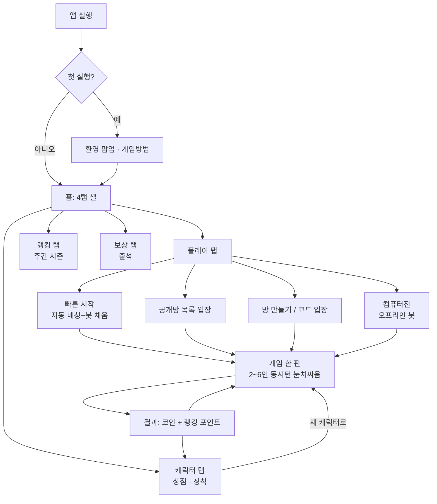
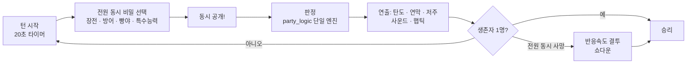
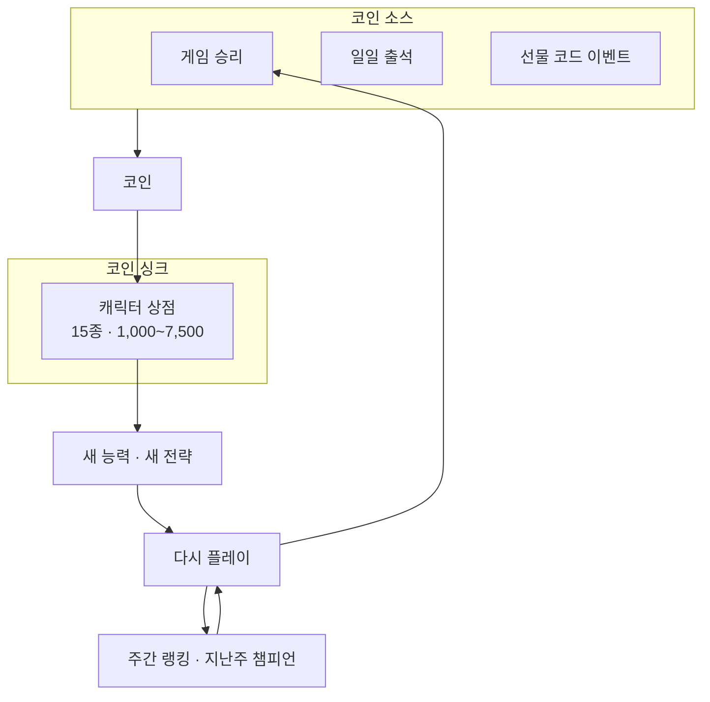
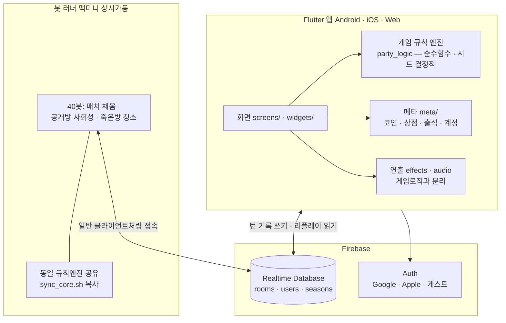
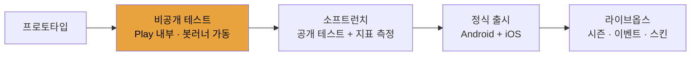

# 카우보이 — Flow Map (설명용 관계도)

> 개발자·기획자·투자자에게 게임을 설명할 때 쓰는 다이어그램 모음.
> GitHub에서 이 파일을 열면 그림으로 렌더링된다(mermaid). 발표용 이미지가 필요하면
> https://mermaid.live 에 코드 블록을 붙여넣고 PNG로 내보내면 된다.

---

## 1. 플레이어 여정 (User Flow) — "유저가 앱에서 뭘 하나"

## 2. 코어 게임 루프 (한 턴) — "게임이 왜 재밌나"

핵심 재미 축: **① 심리전**(동시 선택 눈치싸움) **② 캐릭터 비대칭**(15종 직업 능력) **③ 짧은 판**(수 분 내 결판).

## 3. 경제 · 리텐션 루프 — "왜 또 오나"

> 현재 싱크가 캐릭터뿐 → 전 캐릭터 보유 후 코인 쓸 곳 없음. 백로그의 스킨·일일미션이 이 구멍을 메운다(PRODUCT_PLAN.md §4).

## 4. 시스템 아키텍처 — "어떻게 돌아가나" (개발자·VC용)

설계 포인트(설명 시 강조):
- **서버 로직 없음**: 모든 클라이언트가 턴 히스토리를 각자 리플레이해 같은 결과 도출(시드 결정적 난수). 서버비 ≈ 0.
- **규칙은 한 곳**: `party_logic.dart` 순수함수 + 테스트 204개로 고정 → 봇 러너도 같은 파일 공유.
- **콜드스타트 해결**: 유저가 적어도 봇 러너가 매칭을 성사시키고 로비를 북적이게 유지.

## 5. 제품 단계 (현재 위치) — 로드맵 설명용

**지금 P2.** P3 진입 조건: 분석 이벤트 심기(리텐션 측정 가능) + 게임필 1차 + 일일미션 → PRODUCT_PLAN.md §3.
